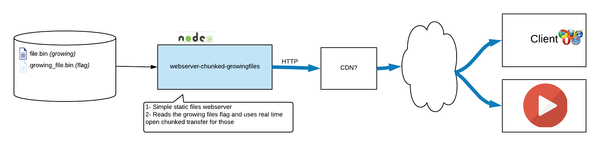

# webserver-chunked-growingfiles

Very simple http server to that uses chunked transfer for growing files.




The system responsible for creating the growing files needs to create a "ghost" file (flag) just before creating the growing file, that ghost file is a simple empty file in the same directory with the name of the real growing file prefixed by some known string (See `GHOST_PREFIX` in the code`).

This webserver detects that ghost file and starts a chunked transfer for those files **keeping the connection open and transfering the file data as soon as it is added to the file**, until that ghost file is removed. So when that file is completed then the system that created it should remove that "ghost" file.

Using this technique **we can transfer any big file (video file for instance) without waiting to have all the file data. Doing that we can reduce dramatically the latency** between the system that creates to file and the receiver. Ideally to almost zero.

Other advantages of this approach is that since it is based on HTTP1.1+ (chunked transfer) we can rely on CDNs for caching the content and we can also take advantage of all HTTP features.

# Usage
```
./index.js [base_dir] [port] [headers_by_extension_config_file] [cors_default] [public_fallback_dir]
```

All params are optional

* **base_dir**: Base directory where the content to serve is. Default: *./*
* **port**: Port to use. Default: *8088*
* **headers_by_extension_config_file**: You can add diferent HTTP headers to the response base on the requested file extension. See example [Headers by extension](./config/headers.json)
* **cors_default**: CORS headers to add to all HTTP responses. See example [CORS headers config](./config/cors.json)
* **public_fallback_dir**: If a file is not found in the main dir, tries to find it here.
